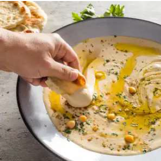

<!-- Replace the img src file path below with the same path you used in the YAML above -->

  

## Ingredients

- 2 (15-ounce) cans chickpeas, rinsed
- ½ teaspoon baking soda
- 4 garlic cloves, peeled
- ½ cup lemon juice (2 lemons), plus extra for seasoning
- 1 teaspoon table salt
- ¼ teaspoon ground cumin, plus extra for garnish
- ½ cup tahini, stirred well
- 2 tablespoons extra-virgin olive oil, plus extra for drizzling
- 1 tablespoon minced fresh parsley

## Instructions

1.	Combine chickpeas, baking soda, and 6 cups water in medium saucepan and bring to boil over high heat. Reduce heat and simmer, stirring occasionally, until chickpea skins begin to float to surface and chickpeas are creamy and very soft, 20 to 25 minutes.

2.	While chickpeas cook, mince garlic using garlic press or rasp-style grater. Measure out 1tablespoon and set aside; discard remaining garlic. Whisk lemon juice, salt, and reserved garlic together in small bowl and let sit for 10 minutes. Strain garlic-lemon mixture through fine-mesh strainer set over bowl, pressing on solids to extract as much liquid as possible; discard solids.

3.	Drain chickpeas in colander and return to saucepan. Fill saucepan with cold water and gently swish chickpeas with your fingers to release skins. Pour off most of water into colander to collect skins, leaving chickpeas behind in saucepan. Repeat filling, swishing, and draining 3 or 4 times until most skins have been removed (this should yield about¾ cup skins); discard skins. Transfer chickpeas to colander to drain.
 
4.	Set aside 2 tablespoons whole chickpeas for garnish. Process garlic-lemon mixture,¼ cup water, cumin, and remaining chickpeas in food processor until smooth, about 1 minute, scraping down sides of bowl as needed. Add tahini and oil and process until hummus is smooth, creamy, and light, about 1 minute, scraping down sides of bowl as needed. (Hummus should have pourable consistency similar to yogurt. If too thick, loosen with water, adding 1 teaspoon at a time.) Season with salt and extra lemon juice to taste.

5.	Transfer to serving bowl and sprinkle with parsley, reserved chickpeas, and extra cumin. Drizzle with extra oil and serve. (Hummus can be refrigerated in airtight container for up to 5 days. Let sit, covered, at room temperature for 30 minutes before serving.)
: `image: "./images/your-image-filename.jpg"`

## Serving Suggestions
- Add other suggestions here!

I love creamy hummus with lots of tahini! This is a great recipe for that! The Tahini sauce alone is amazing on salads and roasted veggies!
