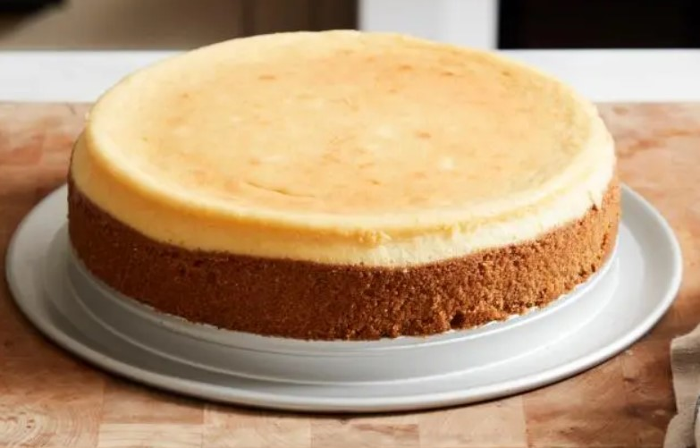

<!-- Replace the img src file path below with the same path you used in the YAML above -->

  

## Ingredients

### Crust
- 2 cups graham cracker crumbs (from about 16 graham crackers)
- 1 stick (8 tablespoons) unsalted butter, melted
- 1/4 cup packed light brown sugar
- 1/4 teaspoon kosher salt 
### Filling
- 2 1/2 pounds cream cheese, at room temperature
- 1 cup granulated sugar
- 1/2 cup heavy cream
- 5 large eggs, at room temperature
- Zest of 1 lemon, plus 2 teaspoons freshly squeezed lemon juice
- 2 teaspoons vanilla extract
- 1/2 teaspoon kosher salt ingredients

## Instructions

1. For the crust: Position an oven rack in the middle of the oven and preheat to 325 degrees F.
2. Mix together the graham cracker crumbs, melted butter, brown sugar and salt in a medium bowl until evenly moistened.
3. Press the crumb mixture into the bottom and halfway up the sides of a 9-inch springform pan. Bake the crust until golden brown, 15 to 18 minutes.
4. Cool completely on a rack. Wrap the bottom and up the sides of the pan with foil and place in a roasting pan.
5. For the filling: Add the cream cheese to a stand mixer fitted with the paddle attachment and beat on medium speed until smooth. Add the granulated sugar and beat, scraping the sides of the bowl as needed, until light and fluffy. Gradually add the cream, beating until combined. Beat in the eggs one at a time. Add the lemon zest and juice, vanilla and salt and beat just until combined, taking care not to over whip. Pour into the crust.
6. Bring a kettle of water to a boil. Carefully place the roasting pan in the oven (don't pull the rack out of the oven). Pour enough hot water in the roasting pan to come about halfway up the side of the foil-wrapped springform pan.
7. Bake until the top of the cheesecake is lightly browned around the edges, but the center still jiggles slightly, about 2 hours.
8. Remove the cheesecake from the roasting pan to a rack. Run a knife around the edges and cool to room temperature. Cover and refrigerate at least 8 hours and up to overnight.
9. Bring the cheesecake to room temperature 30 minutes before serving. Remove the springform ring. Dip a knife in warm water and wipe dry before slicing each piece.

## Serving Suggestions
- Serve with a berry compote from local berries
