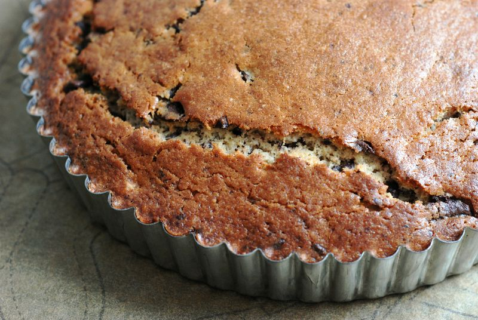

<!-- Replace the img src file path below with the same path you used in the YAML above -->

  

## Ingredients

- Olive oil for the pan
- 3/4 cup spelt flour
- 1 1/2 cups all-purpose flour
- 3/4 cup sugar
- 1 1/2 teaspoons baking powder
- 3/4 teaspoon kosher salt
- 3 eggs
- 1 cup olive oil
- 3/4 cup whole milk
- 1 1/2 tablespoons fresh rosemary, finely chopped
- 5 ounces bittersweet chocolate (70% cacao), chopped into 1/2-inch pieces

## Instructions

1. Preheat the oven to 350 degrees F. (175 degrees C.). Rub a 9 1/2-inch fluted tart pan with olive oil.
2. Sift the dry ingredients into a large bowl, pouring any bits of grain or other ingredients left in the sifter back into the bowl. Set aside.
3. In another large bowl, whisk the eggs thoroughly. Add the olive oil, milk and rosemary and whisk again. Using a spatula, fold the wet ingredients into the dry, gently mixing just until combined. Stir in the chocolate. Pour the batter into the pan, spreading it evenly and smoothing the top.
4. Bake for about 40 minutes, or until the top is domed, golden brown, and a skewer inserted into the center comes out clean. The cake can be eaten warm or cool from the pan, or cooled, wrapped tightly in plastic, and kept for 2 days.

## Serving Suggestions
- Served well with a grapefruit whipped cream.

