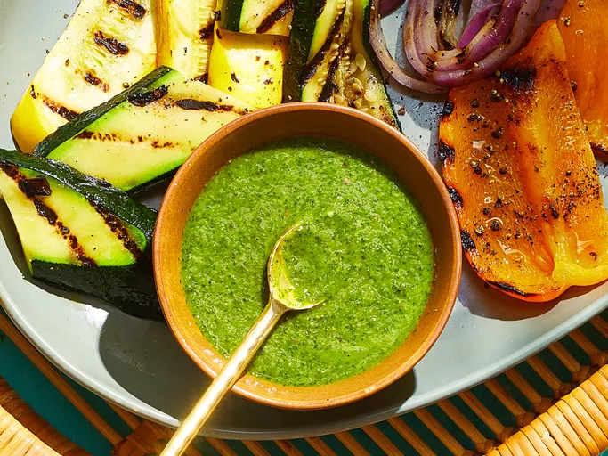

<!-- Replace the img src file path below with the same path you used in the YAML above -->

  

## Ingredients

- 5 cloves of garlic
- 1/2 cup of parsley
- 1/2 cup of cilantro
- 1/2 shallot
- 2 tbsp lemon juice
- 2 tbsp red wine vinegar
- 1/4 cup of olive oil
- red pepper flakes, to taste
- salt, to taste
- oregano, to taste
- black pepper, to taste

## Instructions

1. Add garlic, shallot, parsely, cilantro, lemon juice, red wine vinegar, olive oil into a food processor
2. Flavor the sauce with red pepper flakes, oregano, salt, and black pepper
3. Taste and adjust where needed (typically, I add more red pepper flakes and salt at this point)

## Serving Suggestions

I've been loving adding this chimichurri to avocado toast! It stays good in the fridge for about two weeks.
