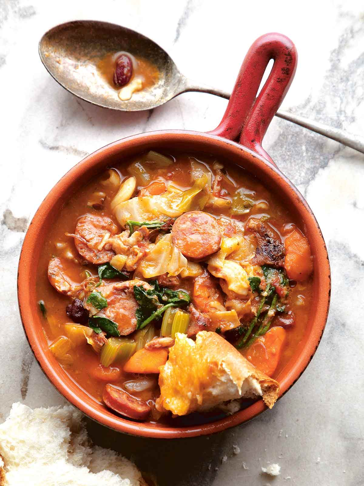

  

*Portuguese bean soup takes an "everything but the kitchen sink" approach by filling a brothy base with nearly everything you can imagine--
including beans, sausage, ham, tomatoes, potatoes, and cabbage. Serve with a sweet, warm roll. Perfection.*

**Servings: 10** 
**Prep time: 30 minutes** 
**Cook time: 3.5 hours** 
**Total time: 5.5 hours** 

# Portuguese Bean Soup

## Ingredients
- 2 pounds (2 to 3 hocks) smoked ham hocks
- 1 tablespoon mild vegetable oil
- 3/4 pound Portuguese chouriço, sliced or crumbled
- 1 large (10 oz) sweet onion, diced
- 1 large (3 1/2 oz) carrot, sliced
- 3 stalks (4 oz) celery, diced
- 3 cloves garlic, peeled and crushed
- 1 large (13 oz) baking potato, peeled and cut into 1-inch (25-mm) cubes
- One (15-ounce) can tomato sauce
- One (14.5-ounce) can diced tomatoes
- One (15.5-ounce) kidney beans, undrained
- 3/4 cup elbow macaroni
- 1 tablespoon granulated sugar
- 1 teaspoon Diamond Crystal (or 3/4 teaspoon Morton) kosher salt, plus more if needed
- 1 teaspoon freshly ground black pepper, plus more if needed
- 1 teaspoon store-bought or homemade pumpkin pie spice
- 1/2 medium head green cabbage, cored and chopped, or 1 bunch kale, trimmed and chopped
- Tabasco sauce or piri-piri sauce, for serving
- Portuguese sweet rolls, for serving

## Instructions
1. In a large pot or Dutch oven, combine ham hocks and 3 quarts of water to cover the hocks.
   Bring to a boil, then reduce the heat and simmer gently, partially covered, until hocks
   start to fall apart when poked with a spoon, 2 to 3 hours.
2. Remove hocks from the pot and pour the broth into a separate container (the broth should
    have now reduced to about 2 quarts; add water if necessary to get to this amount).
    Once hocks have cooled enough to handle, pick all the meat from the bones and reserve.
3. Wipe out the pot you used to simmer the ham hocks. Add the oil and heat over medium-high
   heat until shimmering hot. Add sausage and brown on all sides, about 5 minutes.
4. Reduce heat to medium-low and stir in the onion, carrot, celery, and garlic. Continue
   cooking, stirring occasionally, until the onion is soft and translucent, 10 to 12 minutes.
5. Add 2 quarts of the reserved broth, the potato, tomato sauce, diced tomatoes, kidney beans
   (with liquid), macaroni, sugar, salt, pepper, and pumpkin pie spice and stir. Increase heat
   and bring to a boil, then reduce the heat and cook at a gentle simmer, covered, for 1 hour.
6. Stir in reserved meat from the ham hocks after 30 minutes.
7. Stir in cabbage and cook until crisp-tender, about 5 minutes. Remove from heat and let sit,
   covered, at room temperature for 2 to 3 hours before serving. Even better, let soup chill
   in the fridge overnight. Reheat until warmed through, and adjust with more salt and pepper
   as needed. Serve with Tabasco and Portuguese sweet rolls, if desired.

   *I found this recipe when trying to find a way to use up the ham hocks I had in my freezer. 
   I love the salty, flavorful taste of this soup and love to make it in bulk, then freeze for a quick 
   and delicious dinner on cold nights!*
