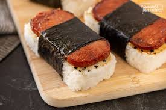

<!-- Replace the img src file path below with the same path you used in the YAML above -->

  

## Ingredients

- Cooked white rice 
- 1 can spam (any type or your favorite flavor)
- Nori roasted seaweed, ideally the "sheet" type like the Sushihane brand)
- Furikake seasoning
- Shoyu
- Brown sugar
- Optional: musubi mold (OR don't toss the spam can -- it can be used as a mold)

## Instructions

1. Prep spam and sauce: cut spam to 1/4" or desired thickness, set aside. Mix 1 cup shoyu and 1 tablespoon brown sugar in a mixing bowl. Toss cut spam in bowl to marinate. Set aside.
2. Cut nori into 2" strips. Set aside. 
3. Heat up pan to low-medium heat. Fry marinated spam to desired crispiness. Keep an eye on the heat, too much heat will burn the spam.
4. Assemble musubis: fill spam can 1/4 full with cooked rice, sprinkle furikake seasoning on top of rice, add crispy spam. Once musubi is to desired shape, wrap 1 nori around musubi.

## Serving Suggestions
- Recommend preparing 2-3 cups of rice per 1 can spam, depending on desired rice to protein ratio :)
- Adjust shoyu and brown sugar ratio to taste!

Enjoy :) 
