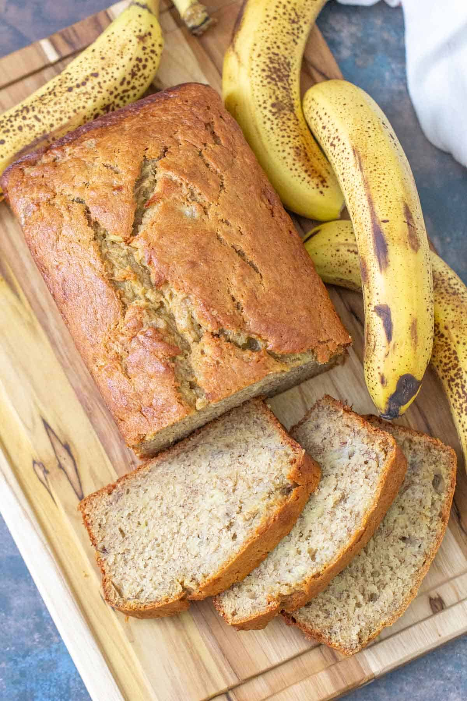

  

# Banana Bread (copied from allrecipes.com)

## Ingredients
- 2 cups all-purpose flour
- 1 teaspoon baking soda
- ¼ teaspoon salt
- ¾ cup brown sugar
- ½ cup butter
- 2 large eggs, beaten
- 2 ⅓ cups mashed overripe bananas
  
## Instructions
1. Gather all ingredients. Preheat the oven to 350 degrees F (175 degrees C). Lightly grease a 9x5-inch loaf pan.
2. Combine flour, baking soda, and salt in a large bowl. Beat brown sugar and butter with an electric mixer in a separate large bowl until smooth. Stir in eggs and mashed bananas until well blended. Stir banana mixture into flour mixture until just combined.
3. Pour batter into the prepared loaf pan.
4. Bake in the preheated oven until a toothpick inserted into the center comes out clean, about 60 minutes.
5. Let bread cool in pan for 10 minutes, then turn out onto a wire rack to cool completely.
6. Eat it.

## Serving Suggestions
Butter is your friend.
