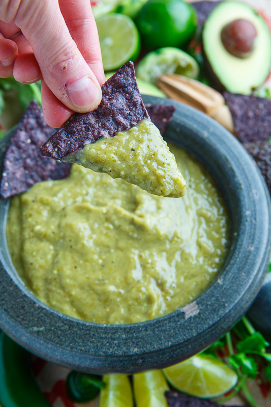

<!-- Replace the img src file path below with the same path you used in the YAML above -->

  

## Ingredients

- 6 Tomatillos
- 1 Bunch Cilantro 
- 2 Limes (Juiced)
- 2 Tablespoon Salt
- 1 Medium White Onion
- 4 Cloves Garlic
- 12 Medium Jalapeños
- 2 Medium Calabaza Squash (Zucchini Substitute)
- 1/2 Cup Neutral Oil (Optional)

## Instructions

1. Remove seeds from Jalapenos if you do not want the recipe to be spicy.
2. Quarter Tomatillos, Onion, Calabaza, and Jalepenos.
3. Grill/Broil Tomatillos, Onion, Garlic, Calabaza, and Jalepenos till soft and burnt.
4. Add Cilantro and blend all ingredients until homogenized.
5. Salt and add lime to taste. 
6. If you want the salsa to be creamy, add neutral oil, and blend until emulsified. 

## Serving Suggestions
- Serve with chips
- Serve with grilled meats
- Serve with carrots/dipping vegetables
