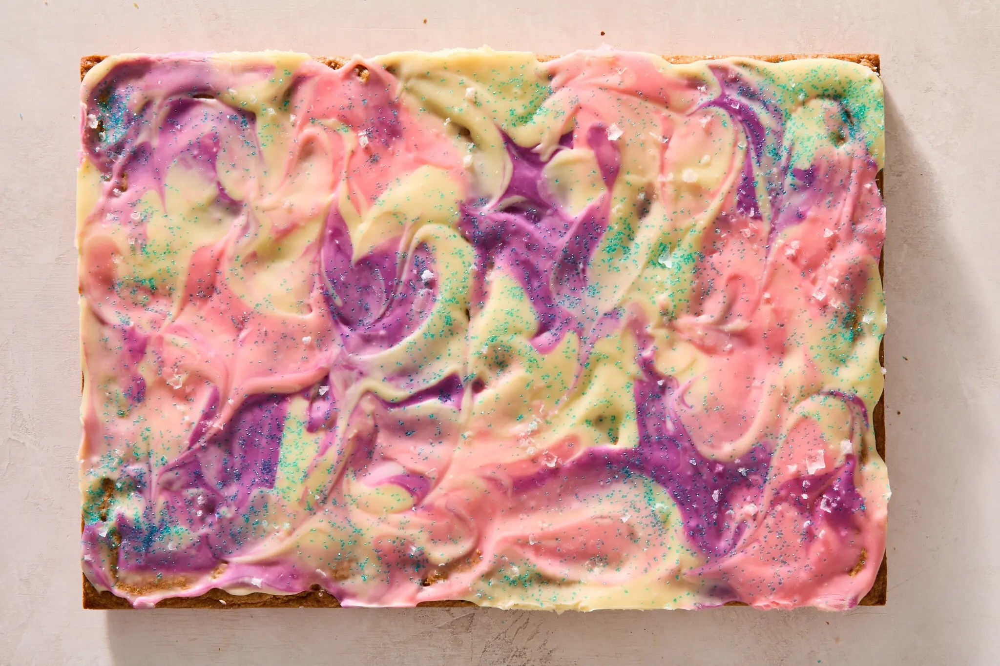

<!-- Replace the img src file path below with the same path you used in the YAML above -->
<p align="center">
  
</p>

## Ingredients
### For the blondies
- 1 cup (227 g) grams unsalted butter plus more for greasing the pan
- 2 ice cubes
- 1 tablespoon vanilla extract
- 2 2/3 cups (340 grams all-purpose flour
- 1 teaspoon baking soda
- 1 teaspoon kosher salt (such as Diamond Crystal) or 1/2 teaspoon fine baking salt
- 1 cup (220 grams) dark brown sugar
- 1/2 cup (100 grams) granulated sugar
- 2 large eggs
- 3/4 cups or 4 oz (113 grams) chopped semisweet chocolate chips
- 3/4 cups or 4 oz (113 grams) mini M&M's
### For the ganache
- 1/2 cup (120 milliliters) heavy cream
- 12 oz (340 grams) chopped white chocolate (about 2 cups see tips)
- Pinch of salt
- 2 gel paste food colorings of choice
- Colored sanding sugar for decorating (optional)
- Flaky sea salt for sprinkle topping

## Instructions
### Make the blondies
1. Heat oven to 350F degrees. Butter a 9-by-13 inch metal baking pan, and line the bottom with parchment paper, leaving an overhand on the 13-inch sides (this creates handles to make it easier to lift the blondies out of the pan after cooling).
2. Brown the butter: in a medium saucepan melt butter over medium heat. Once it bubbles vigorously, cook for 4-6 minutes, swirling occasionally, until the bubbles subside and turn into foam, and toasty brown flecks begin to float on the surface. Turn off heat and scrape the bottom of the pan. Carefully add the ice cubes and stir to melt (mixture will bubble rapidly at first). Pour the browned butter into a heatproof liquid measuring cup. It should measure 1 cup (top off with water if it doesn't make 1 cup). Stir in vanilla extract and set the brown butter mixture aside.
3. In a medium bowl, whisk together the flour, baking soda and salt. In a separate large bowl, whisk both sugars and the brown butter, mixture for about 1 minute until the sugar starts to dissolve and the mixture looks less grainy. Add the eggs one at a time whisking heartily after each addition to mix throoughly.
4. Add the flour mixture to the sugar ixture and using a flexible spatula, stir unitl all but a few pockets of the flour are absorbed. Do not overmix. Fold in the chocolate chips and mini M&M's until evenly distributed and no floury bits remain. Scrape the batter into the prepared pan and spread into an even layer.
5. Bake for 22 to 24 minutes, until the top looks set and the sides begin to pull away from the pan's edges. Remove the pan from the oven and gently tap it a couple times on a clean work surface to create a chewier texture, then let the blondies cool completely in the pan. Transfer to a cutting board (or a wire rack set over a sheet pan) for decorating.

### Make the ganache
6. 

## Serving Suggestions
- Add other suggestions here!

Maybe a kind note, quote, or personal story here. Or perhaps explain why you shared this food?

```
