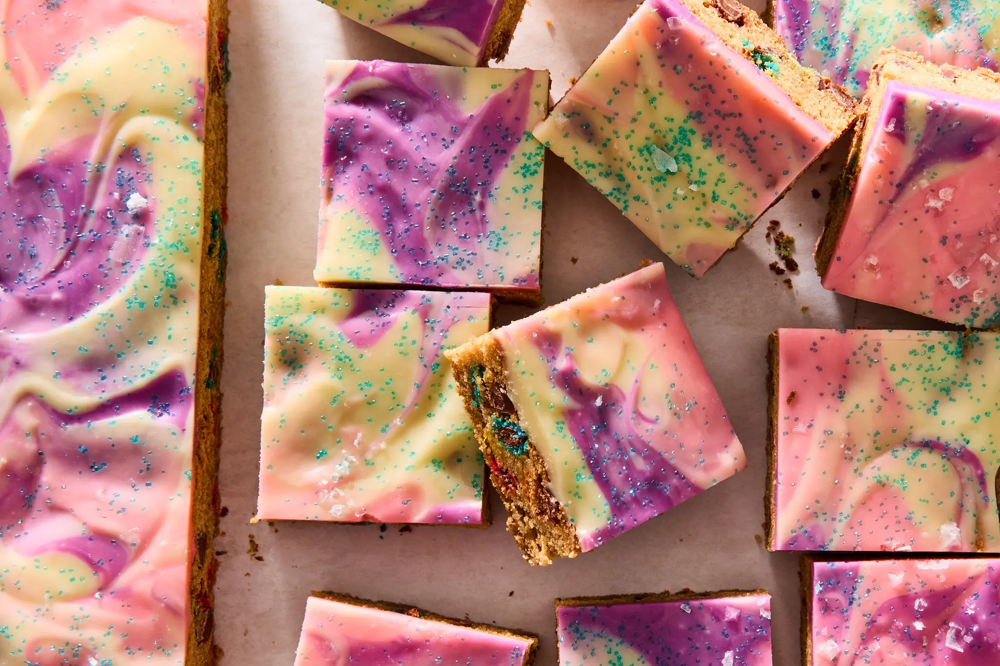

<!-- Replace the img src file path below with the same path you used in the YAML above -->
<p align="center">
  
</p>

## Ingredients

- List
- ingredients
- and
- amounts
- here

## Instructions

1. Add your instructions here in a numbered list for people to follow.
2. If you'd like to include an image, upload your image to the `recipes/images/` folder. See #3 before uploading.
3. Make sure you rename your image with the same name as your recipe file before uploading.
4. Change the recipe.md's image filename in the frontmatter (between `---`). It looks like this: `image: "./images/your-image-filename.jpg"`

## Serving Suggestions
- Add other suggestions here!

Maybe a kind note, quote, or personal story here. Or perhaps explain why you shared this food?

```
