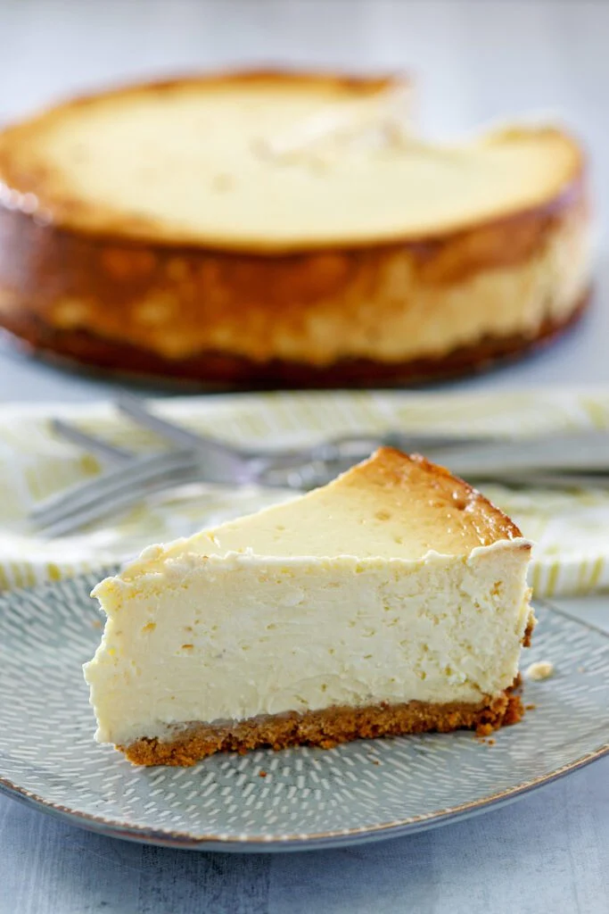

<!-- Replace the img src file path below with the same path you used in the YAML above -->

  

## Ingredients
Recipe intended for 9-inch springform pan.

Crust
- 2 cups gluten free graham crackers (tested for sweetness first; additional sugar may not be needed, depending on brand)
- 1/3 cup unsalted butter, melted
- 2 tbsp sugar
- Cooking spray

Cheesecake filling
- 2 (8-ounce) block of goat cheese, room temperature
- 1 (8-ounce) block of cream cheese, room temperature
- 2/3 cup of sugar (may adjust to taste based on preferred sweetness)
- 1 cup of sour cream (plain, full-fat Greek yogurt acceptable; if using creme-fraiche, half amount, add additional egg and sugar)
- 2 teaspoons of grated lemon rind (approximately one lemon)
- 1 pinch of salt
- 3 large eggs

## Instructions

1. Preheat oven to 325 degrees F.
2. To prepare crust: put graham crackers in food processors. Pulse until loose crumb is made, roughly the texture of sand. Slowly, incoporate butter and sugar, until it loosely sticks together.
3. Wrap 2 layers of tin foil around bottom of pan, attach the springform, and then around the outside of the pan. Thoroughly coat the bottom and sides of the pan with cooking spray. Firmly press the crust mixture into the bottom of the pan and around one-half inch up the sides of the pan. Pack well using the back of a tablespoon.
4. Bake at 325 degrees F for 10 minutes. Cool entirely on wire rack, keeping foil intact. Note, if the crust does not cool completely before adding filling, the resulting crust will be soggy and not properly separate from the pan.
5. To prepare the filling: place the cheeses into a mixing bowl. Beat on medium speed using whisk attachment until smooth. Add sugar and next three ingredients (through vanilla); beat well. Add eggs, one at a time, beating well. Beat well. Mixture should be smooth and pale, without any obvious yolk.
6. Fill tea kettle with water.
7. Pour filling into springform pan over cooled crust. Place pan into a large shallow roasting pan or casserole dish. Please note that differences in material (i.e., metal versus glass) may affect cooking time. Monitor accordingly. Fill roasting pan or casserole dish with hot water, around the spring form pan. Make sure not to splash water between layers of tin foil.
8. Bake at 325 degree F for 1 hour and 20 minutes or until center barely moves when pan is touched. Carefully remove cheesecake and dish from oven; lift cheesecake from dish and play on wire rack. Run a knife around the outside edge of the cheesecake. Allow to cool to room temperature. Cover with plastic wrap and chill in fridge for a minimum of 8 hours.
9. Carefully release from springform pan and place on serving dish when ready.
## Serving Suggestions
- Serves 8 or 1, depending on personal motivation

Emjoy!
