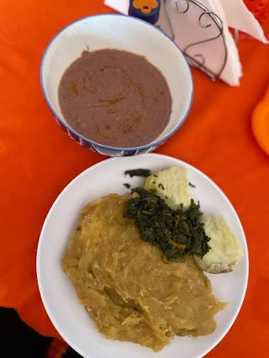

<!-- Replace the img src file path below with the same path you used in the YAML above -->

  

## Ingredients

### For the Matooke

10–12 green plantains (matooke)
Banana leaves or foil (optional, but traditional)
1–2 cups water
A small pinch of salt (optional)

### For the Groundnut (G-Nut) Sauce

1 cup roasted peanuts (groundnuts), finely ground into a paste
2 cups water (adjust for thickness)
1 medium tomato, diced
1 small onion, diced
1–2 cloves garlic, crushed
A small pinch of salt
A drizzle of cooking oil (optional but common)

### For the Traditional Greens

2–3 cups chopped greens (dodo, nakati, or spinach)
1 small onion, chopped
1 tomato, chopped
Salt (small pinch)
1–2 tablespoons oil

### For the Cassava

1–2 large cassava roots
Water
Pinch of salt (optional)

## Instructions

1. Prepare the Matooke (Steamed & Mashed)

Peel matooke and place them in water to prevent browning.
Line a pot with banana leaves if available.
Place the whole peeled matooke inside, cover with more leaves, and add a little water to the bottom of the pot.
Steam for 1½–2 hours on low heat until very soft.
Once cooked, mash using a wooden spoon or potato masher. Traditionally, the leaves are used to wrap and compress the matooke while mashing—aim for a smooth, cohesive mash like the one in the image.
Keep warm.

2. Make Traditional G‑Nut Sauce

Heat a pan with a little oil. Add the onions and tomatoes and cook until softened.
Add garlic and stir for 30 seconds.
Add the groundnut paste gradually, mixing with the cooked vegetables.
Add water slowly while stirring until the sauce becomes smooth.
Simmer on very low heat for 10–15 minutes. Stir frequently to prevent sticking.
Add salt to taste.
The final sauce should be creamy, smooth, and thick—like the bowl in the image.

3. Prepare the Cassava

Peel cassava and cut into chunks.
Rinse thoroughly, removing any fibrous core if needed.
Boil in water for 20–30 minutes until soft.
Drain and keep warm.

4. Cook the Traditional Greens

Heat oil in a pan.
Add onions and sauté until soft.
Add tomatoes and cook until a thick base forms.
Add the chopped greens and cook until just tender (5–10 minutes depending on variety).
Add a pinch of salt.
The greens should remain bright and moist, similar to those shown in the picture.

5. It looks like this: `image: "./images/matooke.jpg"`

## Serving Suggestions
Scoop a generous portion of mashed matooke onto the plate.
Add a serving of the cooked greens beside it.
Add 1–2 pieces of boiled cassava to the side.
Serve the warm g‑nut sauce separately in a small bowl or pour it over the matooke.

