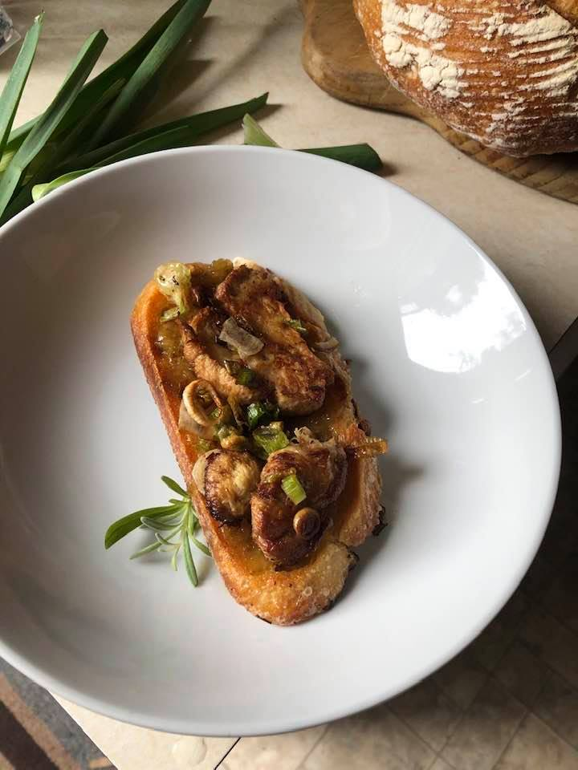

  

# Lion's Mane and Leeks

## Ingredients
- 1 large or several small lion's mane mushrooms
  _Note: This recipe is forgiving of mushroom quality, but firm, unbruised mushrooms are best. Trim softening/browning edges or dirty sections to remove and keep mushrooms clean and dry._
- 1 leek
  _Note: A combination of white and green portions is best, but the ratio is flexible to your taste. _
- your favorite hearty bread
- olive oil
- 1-2 T honey
- optional: butter, salt, fig jam

## Instructions
1. Preparing lion's mane:
   - Trim any softening, browning or dirty portion of the lion's mane to discard
   - Slice lion's mane mushrooms to ~1/2" thickness
3. Preparing leeks:
   - Remove fibrous top edges of leek and slice lengthwise to thoroughly rinse and pat dry
   - Thinly slice leeks (combination of white and green portions is best, but the ratio is flexible to your taste - the white portion will have a milder flavor)
7. Preparing bread:
   - Slice the bread... hopefully further detailed instructions are not needed for this
9. In a large pan, heat 1-2 T olive oil over medium/medium-high heat _See Note 1 below_
11. Add sliced leeks and cook, stirring occassionally until white portions begin to appear transluscent
12. Remove leeks and set aside, salting to taste
13. Add sliced mushrooms to hot (now deliciously leek-flavor infused) oil _See Note 2 below_
15. After 3-4 minutes lift one edge to check for slight browning - once edges begin to brown, flip mushrooms over to cook the other side _See Note 3 below_
17. Remove mushrooms and immediately add salt to taste
18. Add additional olive oil if desired to crisp bread
19. Add bread to heated oil and fry gently on each side until golden brown (or desired level of char)
20. Dress bread with butter and fig jam if desired, add mushrooms and top with delicious leeks

_Note 1: Goal is to not smoke the oil but to have sufficient heat to fry the leaks and mushrooms_
_Note 2: You can add another T oil if desired, we don't want to dry fry lion's mane so ensure there is enough oil left to cover bottom of mushrooms_
_Note 3: Optionally, near end of cooking time for mushrooms, add back in leeks and a dab of butter and baste the mushrooms/leeks with the heated flavor of buttery goodness_

## Serving recommendations
- This recipe is oil heavy, so it goes great as a topper for a fresh salad (arugula is great here) or can be enjoyed all on its own.
- All steps can be adjusted to your taste - in the photo, we had barely any leeks leftover from another recipe that were already chopped so we just used those and it was great.
- Tastes like Oregon!
