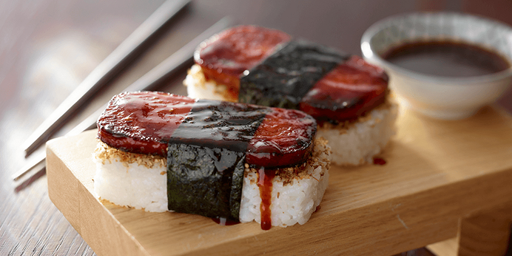

<!-- Replace the img src file path below with the same path you used in the YAML above -->

  

## Ingredients

- 2 slices Spam – sliced 3/8
- 3 ounces cooked white rice, seasoned with furikake and toasted sesame seeds, if desired
- 1 tablespoon soy sauce
- 1 whole sheet nori (seaweed)

## Instructions

1. In large skillet, cook SPAM® Classic until lightly browned and crisp. Drizzle with grill sauce or cooking sauce.
2. Place rice into musubi press or line inside of empty Spam can with plastic wrap and place rice in can. Press rice down firmly.
3. Sprinkle with seasoned furikake and toasted sesame seeds, if desired.
4. Place Spam on rice in press or in can. Press down firmly. Optional: top with remaining rice; press down.
5. Remove Spam and rice from musubi press or can.
6. On work surface, cut nori to desired width.
7. Lay nori shiny-side-down; top with pressed Spm and rice. Wrap nori around pressed SPAM® Classic and rice. Serve immediately.

## Serving Suggestions
- 2 servings
