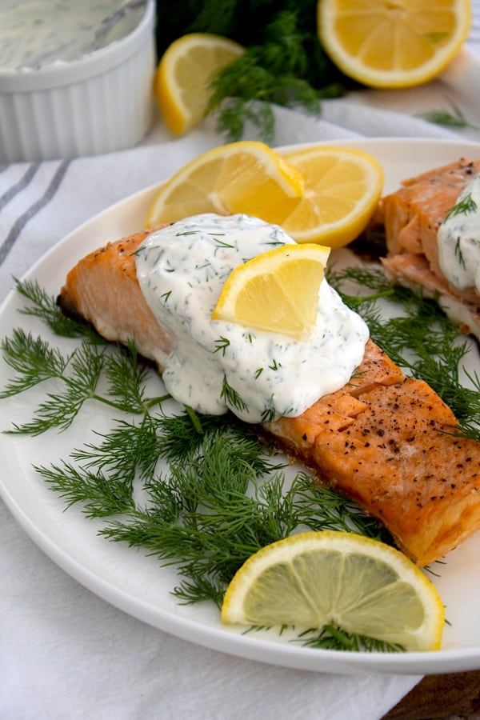

<!-- Replace the img src file path below with the same path you used in the YAML above -->

  

## Ingredients

- wild sockeye salmon fillet (about 1.5 lb)
- olive or avocado oil
- 1 small onion: half sliced thinly, other half diced
- 1 lemon: half sliced thinly, other half juiced
- 1/3 c greek yogurt
- 2 T mayonnaise
- 1 clove garlic, minced
- 2 t horseradish
- 1 T fresh or dried dill
- lemon pepper and salt to taste
- salt and pepepr to taste

## Instructions

1. Preheat oven to 400 degrees F.
2. Line a baking dish with aluminum foil sized to wrap around the salmon fillet.
3. Lay the salmon fillet in the middle.
4. Spread alternating thin slices of onion and lemon across the top. 
5. Spray oil over the salmon, onion and lemon, and then grind lemon pepper and salt over everything.
6. Wrap and seal the foil over the salmon, and bake on middle rack of oven approximately 15 minutes until salmon reaches a temp of 130 degrees.
7. While salmon is baking, make the sauce: in a glass pint jar, combine the diced onion, lemon juice, yogurt, mayonnaise, garlic, horseradish, and lemon pepper and salt to taste.
8. Use immersion blender to blend jar contents into sauce.
9. Add dill.
10. Once salmon reaches temperature, unfold foil, turn on broiler and move salmon to top rack of oven.
11. Broil for approximately 3-4 minutes until lemon and onion are slightly browned.
12. Remove salmon from oven and allow to cool.
13. Serve with sauce poured over the salmon.

## Serving Suggestions
- Recommend serving with wild rice and a green veggie.

