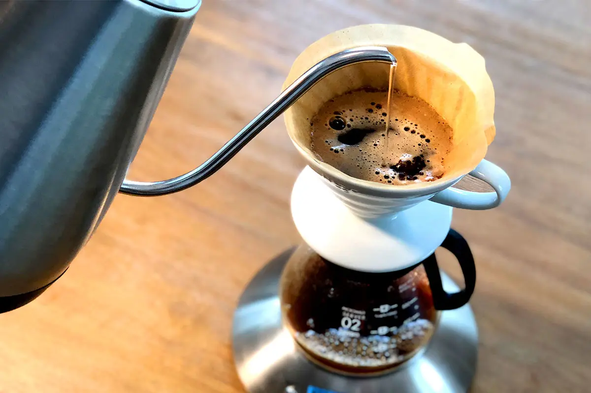

  

# Coffee for One Using a Hario V60 Dripper
## Yield
- One cup (250ml)

## Ingredients
- 250g 95-99°C water, plus extra to rinse filter (use boiling for lighter roasts)
- 15g medium-fine ground coffee

## Instructions

1. Preparation: Place the V60 on a carafe or mug, insert a paper filter, and thoroughly rinse it with hot water. This removes any paper taste and preheats the brewer. Discard the rinse water.
2. Add Coffee: Add 15g of medium-fine ground coffee to the V60 and gently shake it to level the coffee bed.
3. The Bloom (0:00 - 0:45): Start a timer and pour 30-50g of water over the coffee, ensuring all the grounds are saturated. Gently swirl the brewer to incorporate all the coffee grounds. This initial "bloom" allows the coffee to de-gas, leading to a more even extraction. 4. Let it sit for 45 seconds.
5. First Main Pour (0:45 - 1:00): Begin pouring water in a steady, circular motion until the total weight reaches 150g (a 100g pour).
6. Second Main Pour (1:15 - 1:30): At 1:15, resume pouring in the same circular motion until the total weight reaches 250g (another 100g pour).
7. The Swirl: After the final pour, give the brewer one last gentle swirl. This helps to knock down any grounds clinging to the sides of the filter and flatten the coffee bed for a consistent drawdown.
8. Drawdown: Allow the coffee to completely filter through. The total brew time should be between 2:30 and 3:00 minutes. If the brew is too fast, use a finer grind. If it's too slow, opt for a coarser grind.

## Serving Suggestions

- Enjoy this beverage alone, or brew another cup to share.

With thanks and all credit to James Hoffman
