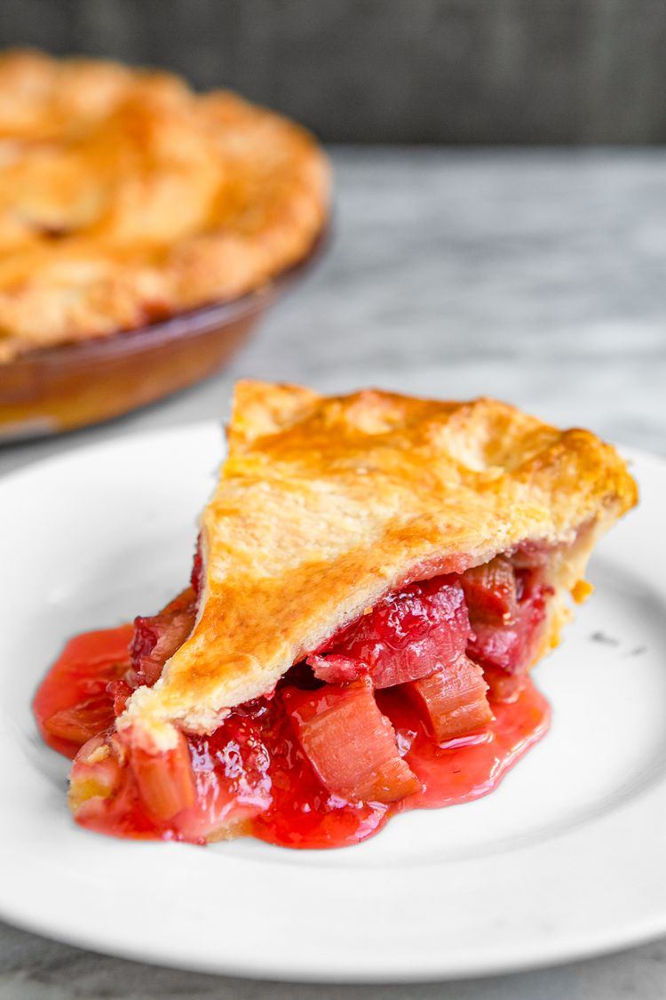

<!-- Replace the img src file path below with the same path you used in the YAML above -->

  

## Ingredients

Fruit: 3 cups fresh rhubarb (cut into ½-inch pieces) and 3 cups fresh strawberries (hulled and quartered).
Sugar: 1/2 to 3/4 cup granulated sugar (depending on your sweet tooth).
Pastry: 1 package (14.1 oz) refrigerated rolled-up pie crusts (contains two crusts).
Butter: 2 tablespoons cold unsalted butter (cut into small pieces).
Egg Wash: 1 large egg mixed with 1 tablespoon of water.

## Instructions

1. Prepare or unroll two 9-inch pie crusts
2. Mix the Filling
3. Assemble the Pie
4. Bake in an oven preheated to 400° F for 15 minutes, then reduce the heat to 350° F and bake for an additional 40 to 50 minutes until the crust is golden brown and the filling is bubbling.

## Serving Suggestions
An average slice (1/8th of a 9-inch pie) of traditional two-crust strawberry rhubarb pie contains approximately 422 calories.

When I was younger, my grandma frequently baked this sweet treat!
