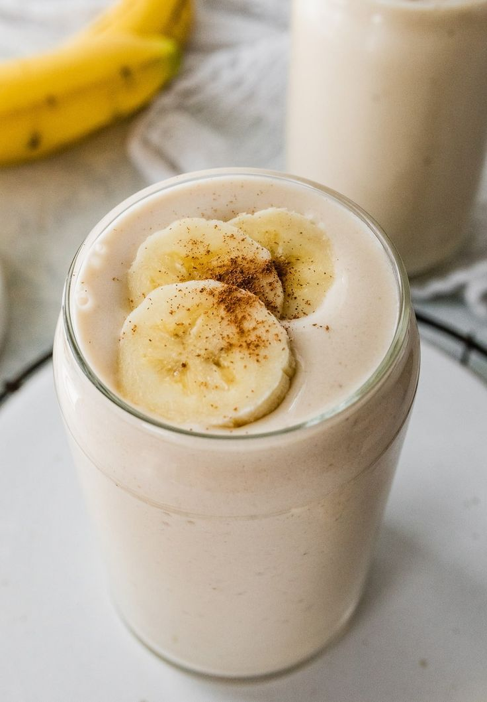

  

# Banana Smoothie

## Serving Suggestions
- As much as you want! It's a great drink to enjoy in any season!

## Ingredients
- 2 ripe bananas
- 1 cup of water
- 1/2 cup of milk
- 1/2 cup of yogurt
- 1 tbsp of flaxseed
- 1/2 cup of ice cubes
- 1 tbsp of honey

## Instructions
1. Blend ingredients together on high until smooth and creamy.
2. You can adjust the thickness by adding more ice or yogurt.
3. Transfer to a cup and enjoy.
