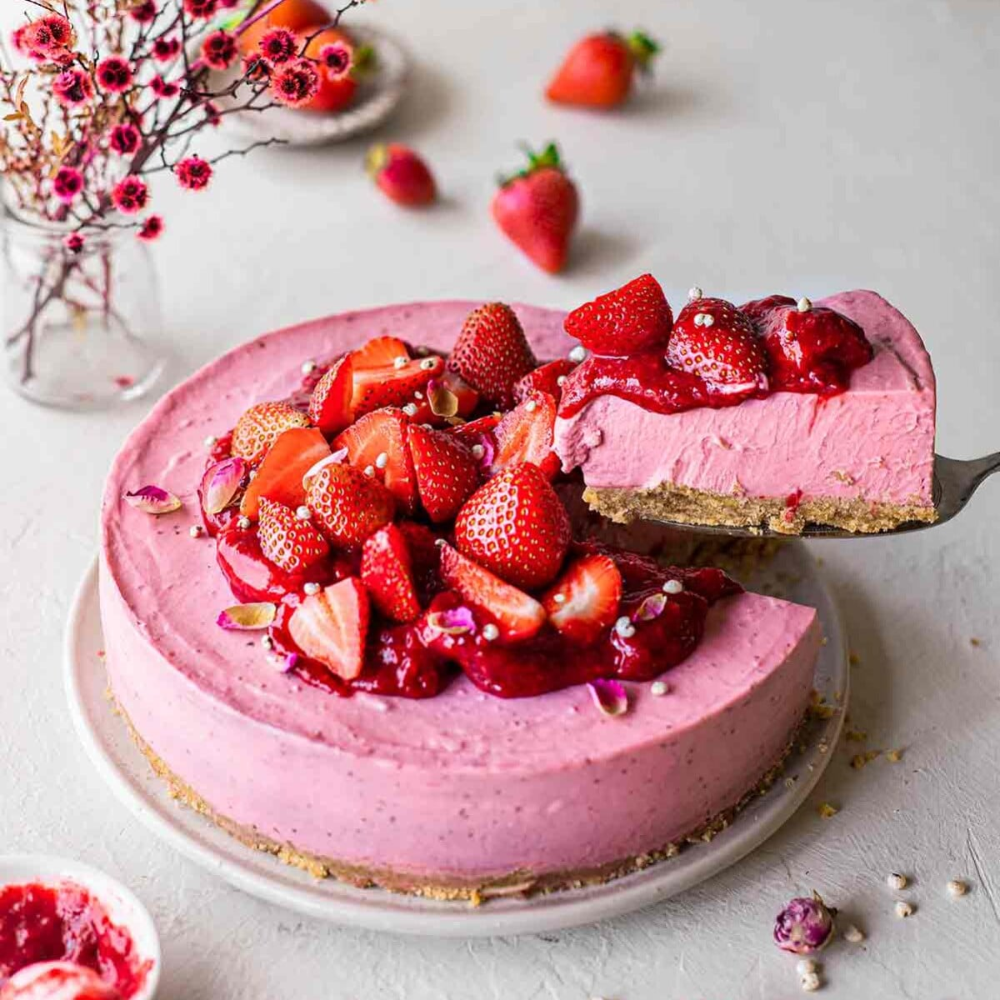

<!-- Replace the img src file path below with the same path you used in the YAML above -->

  

## Ingredients
**Crust**
- 3 cups Oreos. Choose your flavor! I like double chocolate.
- 1/3 cup melted vegan butter.

**Cheesecake Filling**
- 16 oz. vegan cream cheese. I like Violife brand.
- 1/3 cup granulated sugar.
- 3 tablespoons melted coconut oil.
- 3 tablespoons lemon juice and zest.
- 1 teaspoon vanilla extract.
- 3 cups frozen or fresh strawberries.
- 1 cup canned coconut cream.
- 1/4 cup cornstarch.

**Strawberry Topping**
- 1 cup fresh strawberries.
- 1/2 cup fresh raspberries. To keep things interesting.
- 1 tablespoon cornstarch.

## Instructions
**Make the crust**

1. Line an 8-inch (20 cm) springform or loose-bottom cake pan with parchment paper.
2. Add the cookies to a food processor and pulse until it forms fine crumbs. Add the melted butter and pulse until combined. Firmly press the mixture into the bottom of your cake pan. Set aside.

**Make the filling**
1. Add the cream cheese, sugar, coconut oil, lemon juice/zest and vanilla extract to a food processor or blender. Blend until smooth and set aside.
2. Add the strawberries and a dash of water to a medium pot over high heat. Simmer and mash the strawberries until they are mostly broken down. Cook for 10-15 minutes or until the mixture has reduced to around 1/2 heaped cup (~180g). It should have the consistency of thick tomato pasta sauce.
3. Add the coconut cream and cornstarch to the pot with the strawberry reduction. Whisk thoroughly. Bring it to a gentle boil for 5 minutes or until the mixture thickens. Don't worry if the mixture separates!
4. Add the strawberry mixture to your food processor with the cream cheese mixture. Process until the mixture is as smooth as possible. . Taste test the mixture and add more lemon juice or vanilla if desired.
5. Pour the cheesecake filling into your cake pan and smooth the top. Cover the pan and chill it in the fridge for 4 hours or until set.

**Make strawberry topping**
1. Add the majority of the strawberries, optional raspberries, and all the cornstarch to a small saucepan over high heat. Mash the berries with a fork or stick blender. Stir until the berries have turned into a thick sauce. If desired, sweeten the sauce to taste. Allow the compote to cool completely.
2. Just before serving, top the cheesecake with the strawberry compote and reserved fresh strawberries. Leftovers will keep in the fridge for 5 days.

## Serving Suggestions
- I don't know. Slice, serve and eat?
