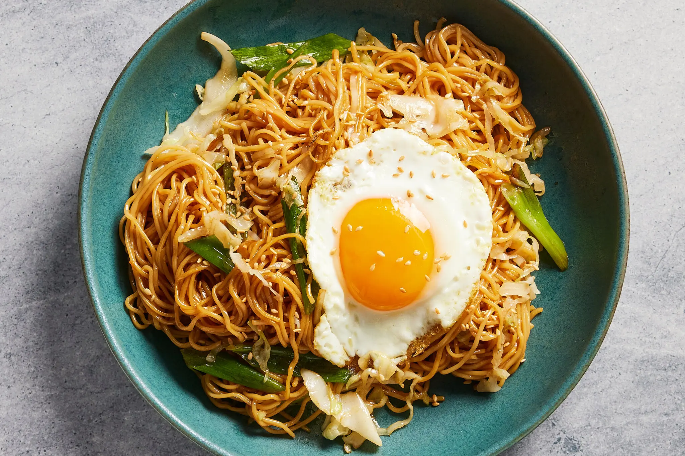

  

# Fried Egg Yakisoba

## Ingredients
- 3 tablespoons vegetable oil
- 2 tablespoons tamari
- 2 tablespoons black bean soy sauce
- 1 tablespoon sesame oil
- 1/2 medium green cabbage
- 1 bunch scallions
- ~1 lb yakisoba noodles (cooked)
- 4 eggs
- sesame seeds
- white pepper

## Instructions
1. Prepare noodles per package instructions, set aside
2. Fry eggs to desired consistency, set aside
3. Heat vegetable oil in wok or large cast iron pan on medium high
4. Thinly slice cabbage and add to pan, season with salt. Cook 2-3 minutes until soft 
5. Trim scallions and cut in half, adding white section to pan. Cook 2-3 minutes
6. Mix tamari, soy sauce, sesame oil, and 3 tablespoons water. Add to pan along with noodles
7. Stir until noodles are well-coated, about 2 minutes
8. Add green half of scallions, coarsely chopped. Cook 2 minutes
9. Divide into four portions and serve topped with egg, sesame seeds, and pinch of pepper

## Serving Suggestions
Eat it piping hot!
