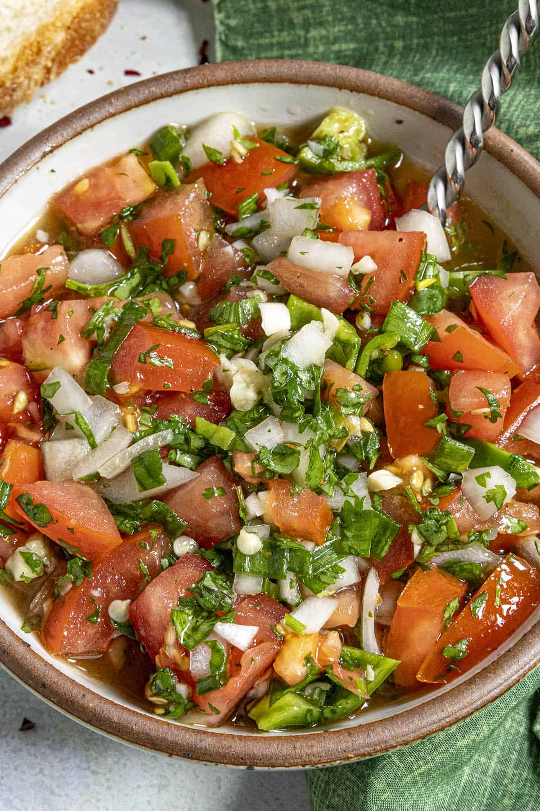

  

# Pebre

## Ingredients
- 1/4 cup neutral oil (Olive oil is good, too)
- 1/4 cup water optional
- 2 tablespoons white wine vinegar
- 4 cloves garlic smashed
- 1 large tomato chopped
- 4-5 Aji Peppers chopped (we used Aji Amarillos - or use jalapenos or serranos)
- 1/2 small onion chopped
- 1/2 cup chopped cilantro (use 1 cup for more defined cilantro flavor)
- 1/4 cup chopped scallions white part and 1 inch of the green
- Salt and pepper to taste

## Instructions
1. Whisk together the oil, water and vinegar with the garlic in a bowl until it thickens a bit.
2. Stir in the remaining ingredients until well combined.
3. Refrigerate about 2 hours to allow flavors to mingle, or serve immediately.

## Serving Suggestions
- Delicious with tortilla chips or more substantial entrees
- Best same day of preparation, when the vegetables are fresh

I learned about this dish from a friend from Chile. Very close to other diced vegetable salsas, but the white wine vinegar gives it a unique flavor. I am including it because the refreshing, uncooked vegetables make it a perfect dip for warm weather.
